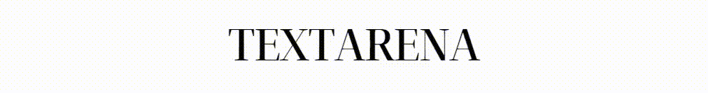
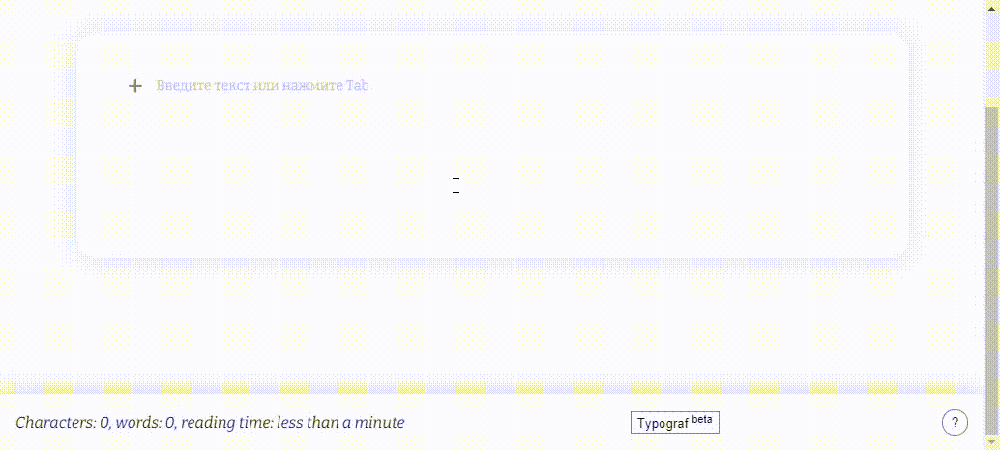

<h4 align="center">Textarena is a simple WYSIWYG (What You See Is What You Get) pluggable editor for rich media stories.</h4>

  <a href="#key-features">Key features</a> •
  <a href="./docs/getting_started.md">Getting started</a> •
  <a href="./docs/plugins.md">Plugins</a> •
  <a href="https://itsumma.github.io/textarena/">Demo</a> •
  <a href="#related">Related</a>

## Key features

There are a few key features:

* [Block elements](#block-elements)
* [Keyboard shortcuts with hints](#keyboard-shortcuts-with-hints)
* [Textarena own parser](#textarena-own-parser)
* [Textarena own change history](#textarena-own-change-history)
* [Style control](#style-control)
* [Typograf support](#typograf-support)

To learn how to install and use Textarena, view [Getting started](./docs/getting_started.md).

### __*Block elements*__
In some other editors, the workspace is represented by a single `contenteditable` element in which you can create various HTML markup. Because of this bugs with moving text fragments or scaling images occur, while parts of the page jump and twitch. There is also an bug with highlighting large parts of the text in the case when you just want to make a few words a heading or bold.

The Textarena workspace consists of separate **blocks**: paragraphs, headings, images, lists, quotes, etc. Each of them is an independent element provided by Textarena Plugin. This allows to avoid such bugs.

### __*Keyboard shortcuts with hints*__
For convenience, there are keyboard shortcuts in the Textarena. They allow you to add Textarena elements, change their order, change the text styling,  insert special characters and manipulate the history of changes.

Of course, in order not to memorize all the keyboard shortcuts, the Textarena has hints. How to view them is described below.

When the cursor is on an empty paragraph, a placeholder hint appears.

Hold Ctrl (Cmd ⌘ on Mac) or Alt (Option ⌥ on Mac) to see shortcut tips.

Creator bar keyboard shortcut tips:  

Toolbar keyboard shortcut tips:  

It is also possible to view hints by clicking on the button with the symbol '`?`'. This button is located in the lower right corner.

### __*Textarena own parser*__
When inserting text from other editors, there may be a problem that additional styles are added. They interfere with the correct display of the text in the current editor and its further formatting.

To avoid this problem, the arena has its own parser. It removes styles and attributes that may affect the editor's work. You can configure which attributes should be kept and which should be avoided in the configuration of plugins. 

You can read more about plugins [here](./docs/plugins.md).

### __*Textarena own change history*__
Depending on the browser, there is a possibility of incorrect operation of the change history, for example, when nothing happens when trying to cancel changes.

To avoid this problem, the arena stores its own history of changes.

### __*Style control*__
Textarena is used on various web resources that have their own styling. 

In order not to violate the design of the web resource,  Textarena supports the ability to control styles and classes assigned to the elements of Textarena. This control is carried out by configuring plugins.

You can read more about plugins [here](./docs/plugins.md).

### __*[Typograf](https://github.com/typograf/typograf) support*__
Textarens supports the package Typograf. It helps to automatically place unbreakable spaces, correct minor typos, bring quotes to the correct form, replace hyphens with dashes in the right places, and much more.

To use the Typograf, select the text and click the button centered at the bottom with the text '`Typograf`'.

## Related

[ng-textarena](https://github.com/devopsprodigy/ng-textarena) - Angular version of the Textarena
