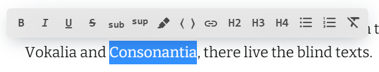
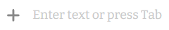

# Textarena
[](https://travis-ci.com/github/devopsprodigy/textarena)

Textarena is a simple WYSIWYG editor

[Demo](https://itsumma.github.io/textarena/)

## Table of Contents

  - [Usage](#usage)
  - [Run for development](#run-for-development)
  - [Recomendations](#recomendations)

## Usage

```js
const elem = document.getElementById('textarena-container');
const initData = {
  // Initial html content of Textarena container
  content: '<h1>Hello, Textarena!</h1>',
};
const textarena = new Textarena(
  elem,
  // Optional configuration object
  {
    // set false to disable editing capabilities
    editable: true,
    // callback which receives TextarenaData object which contains html content of the Textarena container
    onChange: (data) => console.log(`New html: ${data.content}`),
    // Initial Textarena content and metadata
    initData,
  }
);
```

This will render editable text specified via `initData` variable inside
`textarena-container` element in the DOM.

You can specify elements styles, insert lists, heading and links via toolbar



Select text to view toolbar options. Hold Ctrl (Cmd ⌘ on Mac) and Alt (Option ⌥
on Mac) to see shortcut tips.

When cursor is at the empty paragraph, creator bar helper will appear



Click at the plus sign or hit the Alt (Option ⌥ on Mac) - Q shortcut to expand
creator bar


You can click on the item to insert it at the cursor position or use a
keyboard.

## Run for development

Install all Textarena dependencies by yarn:

```
yarn
```

Start the developmnet server:

```
yarn start
```

Open in your browser http://localhost:8080.

## Recomendations

Add paddings arround the editor:

```
.textarena-editor {
  padding: 1rem;
}
```

This will make it easier to select text with the mouse.

## Icons

Icons: https://fonts.google.com/icons?selected=Material+Icons

