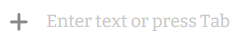
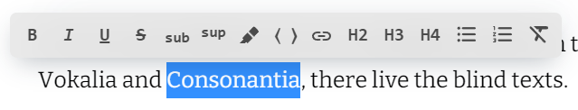
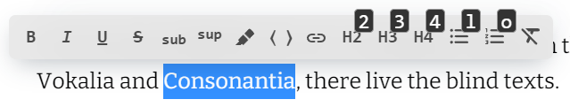

# Getting started

* [Installation](#installation)
* [Usage](#usage)
* [Configuration](#configuration)
* [Run for development](#run-for-development)
* [Recomendations](#recomendations)

## Installation

There are three ways to install Textarena to your project:

1. [Node.js package](#nodejs-package)
0. [Using a CDN](#using-a-cdn)
0. [Manually load file](#manually-load-file)

### Node.js package

Install the package via NPM or Yarn:
```bash
npm install @itsumma/textarena
```
```bash
yarn add @itsumma/textarena
```

Import module in your ES6 application:

```js
import Textarena from '@itsumma/textarena';
```

Or include in your ES5 application:

```js
const Textarena = require('@itsumma/textarena');
```

Then import styles from the package:

```css
@import "/node_modules/@itsumma/textarena/scss/style.scss";
```

Or use the webpack:

```css
@import "@itsumma/textarena";
```

Also you can use other import methods.

### Using a CDN
You can load specific version of package from [jsDelivr](https://www.jsdelivr.com/package/npm/@itsumma/textarena) CDN and add to your page:

```html
<script src="https://cdn.jsdelivr.net/npm/@itsumma/textarena@latest"></script>
<link rel="stylesheet" href="https://cdn.jsdelivr.net/npm/@itsumma/textarena@latest/public/textarena.css">
```

### Manually load file
Load textarena.js and textarena.css files to your project and use them.

## Usage

Add a HTML element to the page with `id='textarena-container'`, for example:

```html
<div id="textarena-container"></div>
```

At JavaScript code initialize Textarena.

```js
import Textarena from '@itsumma/textarena';

const elem = document.getElementById('textarena-container');
const textarena = new Textarena(elem);
```

This will render editable text field inside `textarena-container` element in the DOM.

When the cursor is on an empty paragraph, a placeholder hint appears.



Click at the plus sign or press Tab to expand
creator bar.


You can click on the item to insert it at the cursor position or use arrows or Tab.

You can specify elements styles, insert lists, headings and etc. via toolbar.  
Select text to view toolbar options. 



Hold Ctrl (Cmd ⌘ on Mac) or Alt (Option ⌥ on Mac) to see shortcut tips.



## Configuration

You can configure your Texarena by passing optional configuration object at second parametr of Textarena initialization:

```js
import Textarena from '@itsumma/textarena';

const elem = document.getElementById('textarena-container');
const textarena = new Textarena(
    elem, 
    {
        // Properties of
        // configuration
        // object
    }
);
```

The available properties are listed below:

<table>
<tr>
  <th>
    Property
  </th>
  <th>
    Description
  </th>
</tr>
<tr>
  <td>
    editable
  </td>
  <td>
    A boolean value indicating disable or enable editing capabilities.
  </td>
</tr>
<tr>
  <td>
    debug
  </td>
  <td>
    A boolean value indicating disable or enable editing capabilities.
  </td>
</tr>
<tr>
  <td>
    onChange
  </td>
  <td>

   The callback which receives `TextarenaData` object which contains html or other format like rss and amp of the Textarena container on changing data at Textarena.
  </td>
</tr>
<tr>
  <td>
    onReady
  </td>
  <td>

   The callback which receives `TextarenaData` object which contains html or other format like rss and amp of the Textarena container at the end of loading data into Textarena.
  </td>
</tr>
<tr>
  <td>
    onReady
  </td>
  <td>

   The callback which receives `ArenaEvent` object at each event.
  </td>
</tr>
<tr>
  <td>
    initData
  </td>
  <td>

   The object of initial Textarena content and metadata. Initial content is passing to `dataHTML` property.
  </td>
</tr>
<tr>
  <td>
    placeholder
  </td>
  <td>
    The string with custom placeholder that is displayed in an empty paragraph.
  </td>
</tr>
<tr>
  <td>
    plugins
  </td>
  <td>

   An array of Textarena plugins and their properties. You can find more information about plugins [here](./plugins.md).
  </td>
</tr>
<tr>
  <td>
    toolbar
  </td>
  <td>

   The object of toolbar options:
   * enabled - a boolean value indicating disable or enable toolbar; 
   * tools - string array of Textarena element names.
</tr>
<tr>
  <td>
    creatorBar
  </td>
  <td>

   The object of creator bar options:
   * enabled - a boolean value indicating disable or enable creator bar; 
   * creators - string array of Textarena element names.
</tr>
<tr>
  <td>
    outputTypes
  </td>
  <td>

   A string array of formats of output data generated based on the Textarena. Such as `html`, `amp` or `rss`. 
</tr>
</table>

## Run for development

Install all Textarena dependencies by yarn:

```bash
yarn
```

Start the developmnet server:

```bash
yarn start
```

Open in your browser http://localhost:8080.

## Recomendations

Add paddings arround the editor:

```css
.textarena-editor {
  padding: 1rem;
}
```

This will make it easier to select text with the mouse.