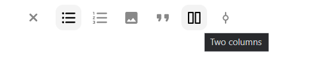

# Plugins

* [Plugins installation](#plugins-installation)
* [Default plugin options](#default-plugin-options)
* [List of standard plugins](#list-of-standard-plugins)

## Plugins installation

By passing `plugins` property in configuration object at second parametr of Texarena initialization you can connect and configure plugins you need. 

```js
import Textarena from '@itsumma/textarena';

const elem = document.getElementById('textarena-container');
const textarena = new Textarena(
    elem,
    {   
        // Other Textarena properties
        plugins: [
            commonPlugin(),
            formatingsPlugin(),
            paragraphPlugin(),
            headersPlugin(),
            hrPlugin({
                marks: [
                    {
                        tag: 'HR',
                        attributes: [],
                    },
                    {
                        tag: 'DIV',
                        attributes: [
                            'class=separator',
                        ],
                    },
                ],
                // Other plugin options
            }),
            // Other plugins
        ]
    }
);
```
## Default plugin options

Basically, plugins that provide Textarena elements have a configuration object with defaul plugin options passed to the method as a parameter. Here you can see porperties of the configuration object:

<table>
<tr>
    <th>Property</th>
    <th>Description</th>
</tr>
<tr>
    <td> 
        name 
    </td>
    <td> 
        Name of the Textarena element, which is also specified in the options of the creator bar or toolbar (if the plugin has a creator or tool). 
    </td>
</tr>
<tr>
   <td colspan="2">

   Example code:
   ```js
    plugins: [ 
        somePlugin({ 
            name: 'element',
            // Other plugin options
        }),
        // Other plugins
    ],
    toolbar: { tools: [ 'element' ] },
    creatorBar: { creators: [ 'element' ] },
    // Other Textarena properties
   ```
  </td>
</tr>
<tr>
    <td> 
        tag
    </td>
    <td> 
        Tag of the generated textarena HTML element.
    </td>
</tr>
<tr>
   <td colspan="2">

   Example code:
   ```js
    tag: 'ARENA-ELEMENT'
   ```
   Result:
   ```html
    <arena-element>
        <p class="paragraph">Element</p>
    </arena-element>
   ```
   </td>
</tr>
</tr>
<tr>
    <td> 
        attributes
    </td>
    <td> 
        Attributes added when the textarena HTML element is generated.
    </td>
</tr>
<tr>
<tr>
   <td colspan="2">

   Example code:
   ```js
    attributes: { 
        class: 'element-class',
        // Other attributes
    }
   ```
   Result:
   ```html
    <arena-element class="element-class">
        <p class="paragraph">Element with class</p>
    </arena-element>
   ```
   </td>
</tr>
<tr>
    <td> 
        allowedAttributes
    </td>
    <td> 
        Textarena has own parser. This property specifies an array of attributes that will not be cleared by Textarena.
    </td>
</tr>
<tr>
   <td colspan="2">

   Example code:
   ```js
    allowedAttributes: [
        'start',
        // Other attributes
    ]
   ```
   </td>
</tr>
<tr>
    <td> 
        title
    </td>
    <td> 
        The title of the plugin that is displayed in the bars when the cursor hovers. Or if the plugin doesn't have an icon.
    </td>
</tr>
<tr>
   <td colspan="2">

   Example code:
   ```js
    title: 'Two columns'
   ```
   Result:

   with icon  
    

   without icon  
   
   </td>
</tr>
<tr>
    <td> 
        icon
    </td>
    <td> 
        HTML that defines how the element will be displayed in the bars.
    </td>
</tr>
<tr>
   <td colspan="2">

   Example code:
   ```js
    icon: `<svg width="24" height="24" viewBox="0 0 24 24" fill="none" xmlns="http://www.w3.org/2000/svg">
        <path d="M22 7L12 17L2 7" stroke="#303030" stroke-width="2"/>
    </svg>`
   ```
   </td>
</tr>
<tr>
    <td> 
        shortcut
    </td>
    <td> 
        Keyboard shortcut that you can use to add the Textarena element.
    </td>
</tr>
<tr>
   <td colspan="2">

   Example code:
   ```js
    shortcut: 'Alt + KeyA'
   ```
   </td>
</tr>
<tr>
    <td> 
        description
    </td>
    <td> 
        Description of the keyboard shortcut that will be displayed in the tooltips window.
    </td>
</tr>
<tr>
   <td colspan="2">

   Example code:
   ```js
    description: 'A secondary header'
   ```

   Result:

   
   </td>
</tr>
<tr>
    <td> 
        hint
    </td>
    <td> 
        A hint that you can see on the bars by holding down Ctrl (Cmd ⌘ on Mac) or Alt (Option ⌥
        on Mac).
    </td>
</tr>
<tr>
   <td colspan="2">

   Example code:
   ```js
    hint: 'a'
   ```

   Result:

   creator bar hint / toolbar hint  
    
   
</td>
</tr>
<tr>
    <td> 
        component
    </td>
   <td>

   Name of tag for define customElements. Requires the property `componentConstructor`. Have to be the same as property `tag`.
   </td>
</tr>
<tr>
   <td colspan="2">

   Example code:
   ```js
    tag: 'ARENA-ELEMENT',
    component: 'arena-element',
    componentConstructor: ArenaElement
   ```
   Add this code to plugin register method:
   ```js
    if (component && componentConstructor && !customElements.get(component)) {
        customElements.define(component, componentConstructor);
    }
   ```
</td>
</tr>
<tr>
    <td> 
        componentConstructor
    </td>
   <td>

   Constructor for define customElements. Requires the property `component`. Allows you to convert the source code into arena elements. It is advisable to use together with the property `output`.
   </td>
</tr>
<tr>
   <td colspan="2">

   Example code:
   ```js
    component: 'arena-element',
    componentConstructor: ArenaElement
   ```
   Component constructor class:
   ```js
    import {
    LitElement, html, css, TemplateResult,
    } from 'lit-element';

    export default class ArenaElement extends LitElement {
        static styles = css`
            :host {
            display: flex;
            min-height: 2em;
            }
        `;

        render(): TemplateResult {
            return html`
            <slot></slot>
            <slot></slot>
            `;
        }
    }
   ```
   Add this code to plugin register method:
   ```js
    if (component && componentConstructor && !customElements.get(component)) {
        customElements.define(component, componentConstructor);
    }
   ```
   </td>
</tr>
<tr>
    <td> 
        marks
    </td>
   <td>
    
   Tags and attributes with values by which the Textarena parser determines which elements will be converted into an Textarena element. You can also specify attributes with values in the property `excludeAttributes` by which the parser will ignore the element. 
   </td>
</tr>
<tr>
   <td colspan="2">

   Example code:
   ```js
    marks: [
        {
            tag: 'B',
            attributes: [],
            excludeAttributes: [
                'style=fontWeight:normal',
            ],
        },
        {
            tag: 'STRONG',
            attributes: [],
        },
        {
            tag: 'SPAN',
            attributes: [
                'style=fontWeight:bold',
            ],
        },
    ]
   ```

</td>
</tr>
<tr>
    <td> 
        command
    </td>
    <td> 
        The command identifier of adding an Textarena element, which will also be saved in the history and displayed in the logs. Must be unique.
    </td>
</tr>
<tr>
   <td colspan="2">

   Example code:
   ```js
    command: 'add-arena-element'
   ```
</td>
</tr>
<tr>
    <td> 
        output
    </td>
   <td> 

   Allows you to convert the arena elements to the desired format at the output. It is advisable to use together with property `componentConstructor`.
   </td>
</tr>
<tr>
   <td colspan="2">

   Example code:
   ```js
    output: outputQuoteBlock
   ```
   ```js
    import { ArenaFormatings } from '@itsumma/textarena/src/interfaces/ArenaFormating';
    import { AnyArenaNode } from '@itsumma/textarena/src//interfaces/ArenaNode';

    const outputQuoteBlock = (
    type: string,
    node: AnyArenaNode,
    frms: ArenaFormatings,
    ): string => {
    if (['html', 'amp', 'rss'].includes(type)) {
        const image = node.hasChildren && node.children[0]
        ? `<div class="quote-block__image">${node.children[0].getOutput(type, frms)}</div>` : '';
        const author = node.hasChildren && node.children[1]
        ? node.children[1].getOutput(type, frms) : '';
        const role = node.hasChildren && node.children[2]
        ? node.children[2].getOutput(type, frms) : '';
        const body = node.hasChildren && node.children[3]
        ? node.children[3].getOutput(type, frms) : '';
        const authorBlock = author || role ? `
        <div class="quote-block__author-block">
            ${author}
            ${role}
        </div>
        ` : '';
        return `
        <blockquote class="quote-block">
            <div class="quote-block__line">
            ${authorBlock}
            ${image}
            </div>
            ${body}
        </blockquote>
        `;
    }
    return '';
    };

    export default outputQuoteBlock;
   ```
   </td>
</tr>
</table>

## List of standard plugins:

* pastePlugin  
is necessary for correct paste of text from third-party sources.

* [paragraphPlugin](./plugins/paragraphPlugin.md)  
is the common plugin wich provides simple text paragraph.

* [commonPlugin](./plugins/commonPlugin.md)  
registers common commands and their keyboard shortcuts.

* [formatingsPlugin](./plugins/formatingsPlugin.md)  
registers elements of inline text formatting.

* [headersPlugin](./plugins/headersPlugin.md)  
registers headings elements.

* [hrPlugin](./plugins/hrPlugin.md)  
registers a horizontal rule - a line that goes across the Textarena area.

* [blockquotePlugin](./plugins/blockquotePlugin.md)  
registers simple qoute element.

* [calloutPlugin](./plugins/calloutPlugin.md)  
registers a block for displaying important information inside which you can add other elements of the Textarena.

* [embedPlugin](./plugins/embedPlugin.md)  
registers element that allows you to embed external content.

* [linkPlugin](./plugins/linkPlugin.md)  
registers inline link element.

* [asidePlugin](./plugins/asidePlugin.md)  
registers a block with a frame inside which you can add other elements of the Textarena.

* [codePlugin](./plugins/codePlugin.md)  
registers element where text is displayed in a fixed-width font, and the text preserves both spaces and line breaks.

* [quotePlugin](./plugins/quotePlugin.md)  
registers complex qoute element.

* [typoSugarPlugin](./plugins/typoSugarPlugin.md)  
registers some special characters and their keyboard shortcuts.

* [listsPlugin](./plugins/listsPlugin.md)  
registers list elements.

* [nestedlistsPlugin (Alpha version)](./plugins/nestedlistsPlugin.md)  
registers multilevel list elements.

* [twoColumnsPlugin](./plugins/twoColumnsPlugin.md)  
registers a two cloumn block.

* [roadmapPlugin](./plugins/roadmapPlugin.md)  
registers a roadmap element.

* [imagePlugin](./plugins/imagePlugin.md)  
registers element of the image.

* [figurePlugin](./plugins/figurePlugin.md)  
registers element of the image with caption.

* [contentsPlugin](./plugins/contentsPlugin.md)  
registers element of the table of contents.

* [videoPlugin](./plugins/videoPlugin.md)  
registers video element.

* [backImagePlugin](./plugins/backImagePlugin.md)  
registers an element with a background image in which you can add other elements of the Textarena.

* [tablePlugin (Alpha version)](./plugins/tablePlugin.md)  
registers table element.